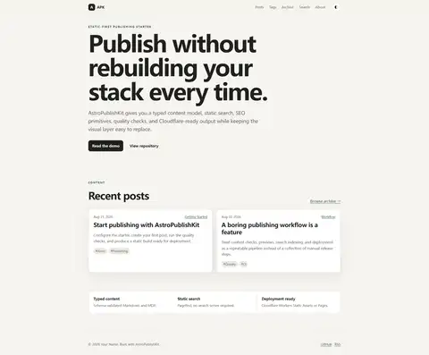

# AstroPublishKit

[](https://github.com/oyjq0000/AstroPublishKit/actions/workflows/ci.yml)
[](https://astro.build/)
[](https://pages.cloudflare.com/)
[](LICENSE)

A clean, static-first Astro publishing starter for blogs, technical notes, and content-focused sites.

**Live demo:** https://astropublishkit.pages.dev/

<p align="center">
  <a href="https://astropublishkit.pages.dev/">
    
  </a>
</p>

AstroPublishKit is deliberately more **publishing kit** than **theme**: typed content, search, SEO/discovery, quality gates, and deployment defaults are built in, while the visual layer stays small and replaceable.

## What you get

- Astro 7 + Markdown/MDX + typed Content Collections
- neutral responsive design with light/dark mode
- posts, categories, tags, archive and reading-time metadata
- Pagefind static search
- table of contents, sharing, back-to-top, callout/accordion/video primitives
- canonical URLs, Open Graph, Twitter cards and JSON-LD
- sitemap with article `lastModified` and `noindex` filtering
- RSS, robots.txt and llms.txt
- optional Giscus, Cloudflare Web Analytics and Umami, all off by default
- `new-post`, content checks, safety checks and unit tests
- GitHub Actions CI
- Cloudflare Pages and Workers Static Assets deployment paths

No database, admin panel, SSR runtime, production analytics account, or private site content is required.

## Quick start

Requirements: Node.js 22.13+.

Use **Use this template** on GitHub after the repository is published as a template, or clone it normally:

```bash
git clone https://github.com/oyjq0000/AstroPublishKit.git
cd AstroPublishKit
npm install
npm run dev
```

Then edit `astro-publish-kit.config.mjs` and replace the demo identity.

Create a draft:

```bash
npm run new-post -- my-first-post
```

Run the full release gate:

```bash
npm run check
```

Build output is written to `dist/`, and Pagefind indexes that output during the build command.

## Configuration

The main configuration surface is:

```text
astro-publish-kit.config.mjs
```

Use it for site identity, canonical URL, author, navigation, social links, locale, and homepage copy.

For every real deployment, set the canonical production origin explicitly:

```bash
SITE_URL=https://your-domain.example
```

The source fallback remains `https://example.com` intentionally so a copied starter cannot silently claim the AstroPublishKit demo URL as its canonical origin.

Optional integrations are documented in `.env.example`. Empty variables keep integrations disabled.

## Content

Posts live in:

```text
src/content/posts/
```

Minimal frontmatter:

```yaml
---
title: My useful post
description: A useful standalone summary for readers and search engines.
date: 2026-08-31
category: Engineering
tags: [Astro]
draft: false
noindex: false
---
```

See `docs/content.md` for the full model and MDX components.

## Cloudflare Pages

The public demo at `astropublishkit.pages.dev` is deployed from `main` with these settings:

| Setting | Value |
| --- | --- |
| Production branch | `main` |
| Build command | `npm run build` |
| Build output directory | `dist` |
| `SITE_URL` | `https://astropublishkit.pages.dev` for the demo; use your own production origin |
| `NODE_VERSION` | `22.13.0` or newer Node 22 |

Every push to the production branch triggers a fresh Pages deployment when Git integration is enabled.

## Cloudflare Workers Static Assets

The repository also includes `wrangler.jsonc` with `assets.directory` set to `./dist`. Change the project name, configure `SITE_URL`, then run:

```bash
npm run deploy:cf
```

Because the default site is fully prerendered, no Worker entry point or `@astrojs/cloudflare` adapter is needed.

See `docs/deployment.md` for more deployment details.

## Project checks

```bash
npm run typecheck
npm run test
npm run check:content
npm run check:safety
npm run build
```

`npm run check` runs the complete sequence. CI requires the same gate to pass before a change is considered release-ready.

`check:safety` intentionally scans the public implementation for production identifiers and common secret patterns. The provenance/audit documents are separate records and are not used as application input.

## Project structure

```text
src/content/posts/              Markdown and MDX posts
src/components/                 Small reusable UI/MDX primitives
src/pages/                      Static routes and feeds
src/styles/global.css           Replaceable visual layer
astro-publish-kit.config.mjs    Primary site configuration
scripts/                        Authoring and quality checks
docs/                           Content, customization, deployment docs
```

## Scope

`feature-matrix.md` is the current product contract. The initial release intentionally excludes:

- databases and CMS backends;
- authentication;
- migration tooling from any personal site;
- built-in ad accounts;
- mass AI content generation;
- game/wiki-specific components;
- a clone of AstroPaper, Fuwari, Retypeset, or AnvilWiki's visual identity.

## Provenance

This repository has an independent Git history. It was built after auditing an existing Astro blog and researching several public projects; private content and source history were not copied.

See:

- `source-audit.md`
- `reference-projects.md`
- `feature-matrix.md`
- `THIRD_PARTY_NOTICES.md`

## License

MIT. See `LICENSE` and `THIRD_PARTY_NOTICES.md`.
