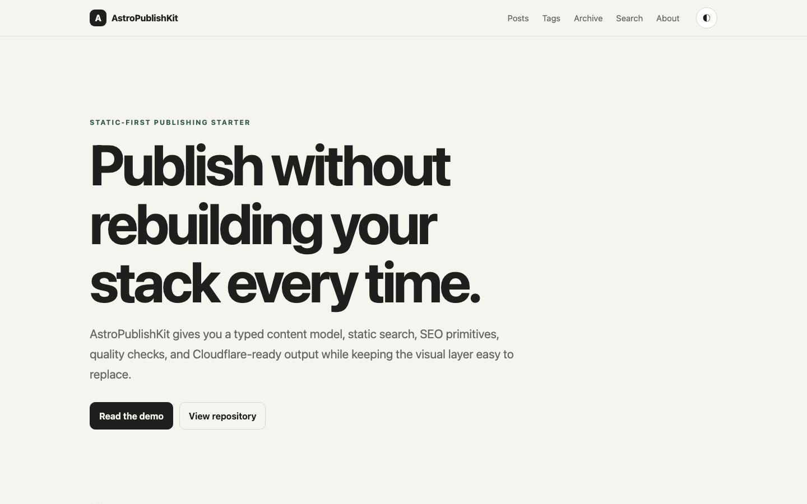
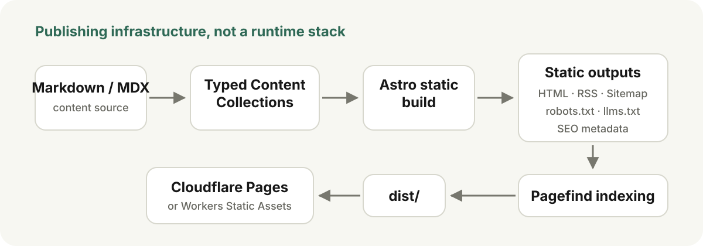
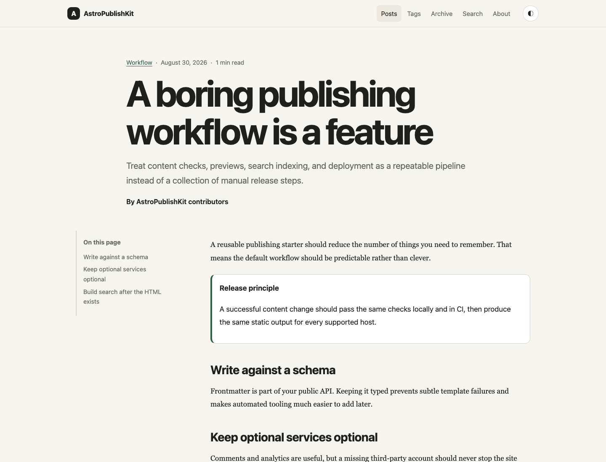
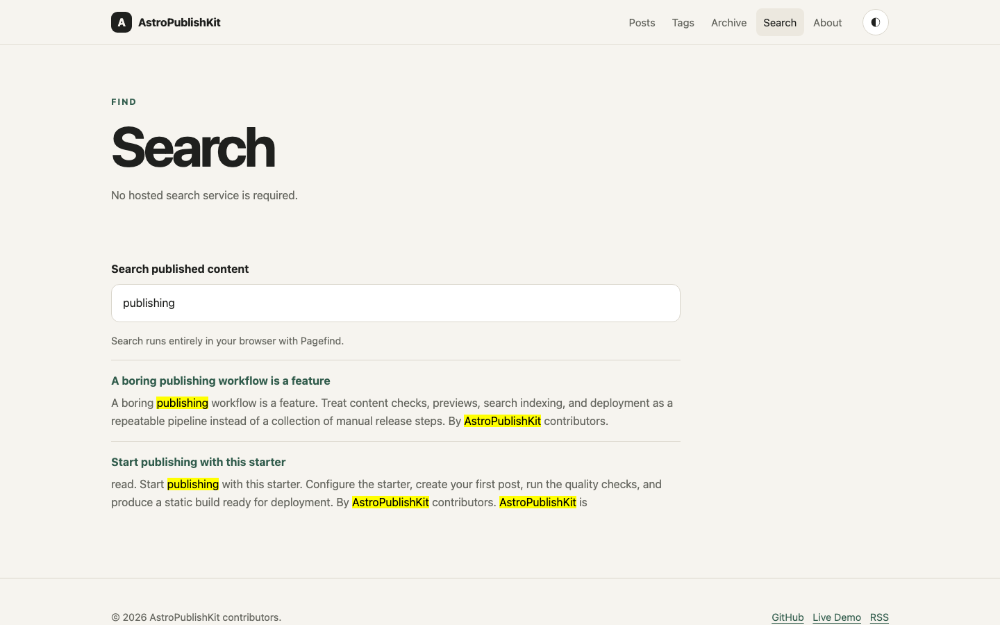
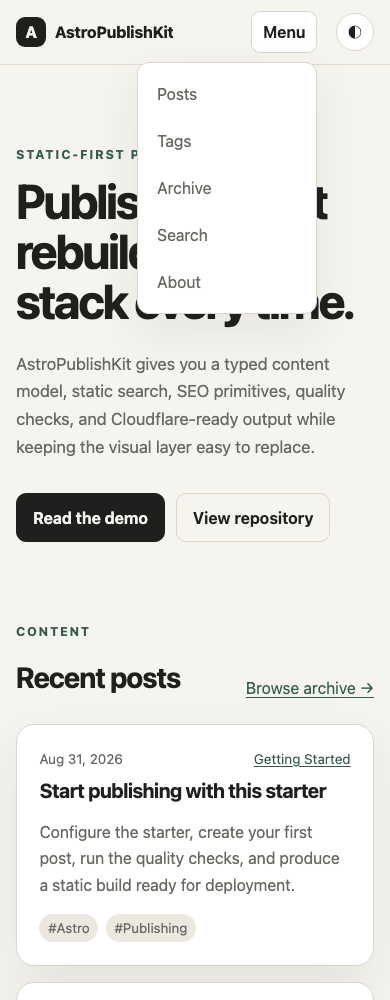

# AstroPublishKit

<p align="center">
  <strong>English</strong> ·
  <a href="README.zh-CN.md">简体中文</a>
</p>

[](https://github.com/oyjq0000/AstroPublishKit/actions/workflows/ci.yml)
[](https://astro.build/)
[](https://pages.cloudflare.com/)
[](LICENSE)

A clean, static-first Astro publishing starter for blogs, technical notes, and content-focused sites.

**Live demo:** https://astropublishkit.pages.dev/

<p align="center">
  <a href="https://astropublishkit.pages.dev/">
    
  </a>
</p>

AstroPublishKit focuses on **publishing infrastructure first**:

- ✓ typed content model
- ✓ Markdown / MDX authoring
- ✓ static search and SEO/discovery outputs
- ✓ local authoring helpers
- ✓ strong quality checks
- ✓ static deployment defaults

The included visual layer is intentionally minimal and replaceable. The default site builds to plain static files in `dist/`; no database, CMS, Node server, SSR runtime, or hosted search backend is required.

<p align="center">
  
</p>

## 5-minute setup

Requirements: Node.js 22.22.3+.

1. Click **Use this template** on GitHub (recommended), or clone the repository.
2. Install the locked dependencies with `npm ci`.
3. Edit `astro-publish-kit.config.mjs` and replace the demo identity.
4. Set `SITE_URL` to your production HTTPS origin before the production build.
5. Create a draft with `npm run new-post` or `npm run new-post -- my-first-post`.
6. Write and preview with `npm run dev`.
7. Run `npm run check`, set `draft: false`, then build the final static output.

```bash
git clone https://github.com/oyjq0000/AstroPublishKit.git
cd AstroPublishKit
npm ci
npm run new-post
npm run dev
```

> **Production requirement:** `SITE_URL` must be set before deploying. `npm run build:production` intentionally fails when it is missing or still points to `https://example.com`.

`SITE_URL` controls the production origin used by canonical URLs, sitemap, RSS, robots.txt, JSON-LD, llms.txt, Open Graph URLs, and sharing URLs.

## Publishing workflow

v0.2.0 keeps the authoring loop local and explicit:

```bash
# Create a guided draft
npm run new-post

# Or keep the fast non-interactive workflow
npm run new-post -- my-post

# See unfinished posts
npm run drafts

# Write and preview, including direct draft URLs
npm run dev

# Run the complete release gate
npm run check

# Review the final static output + Pagefind index
npm run build
npm run preview
```

New posts default to `draft: true`. During `npm run dev`, a draft can be opened directly at `/posts/<slug>/` without publishing it. Production builds still exclude drafts.

When the article is ready, change `draft` to `false`, run the checks, then run the production smoke build with the real origin:

```bash
SITE_URL=https://your-domain.example npm run build:production
```

See **[Writing workflow](docs/writing-workflow.md)** for the complete create → write → preview → check → publish sequence.

Migrating an existing site? See **[Existing blog → AstroPublishKit migration checklist](docs/migration-checklist.md)** before assuming content success also preserves URLs, assets or SEO continuity.

## What you get

- Astro 7 + Markdown/MDX + typed Content Collections
- guided `new-post` plus backward-compatible non-interactive creation
- Markdown and MDX file creation with slug normalization and duplicate protection
- draft listing and development-only direct draft preview
- responsive light/dark interface with mobile navigation
- posts, categories, tags, archive, reading time and article metadata
- optional per-article Summary / Quick Answer block
- deterministic build-time Related Posts from exact shared tags and category
- Pagefind static search
- table of contents, sharing and back-to-top
- Callout, Accordion and YouTube MDX primitives
- canonical URLs, Open Graph, Twitter Cards and JSON-LD
- sitemap with article `lastModified` and `noindex` filtering
- RSS, robots.txt and llms.txt
- optional Giscus, Cloudflare Web Analytics and Umami, all off by default
- ESLint, Prettier, config/content/link/sitemap/safety checks, unit tests and template regression checks
- author-facing content diagnostics with errors, warnings, fix hints and a final summary
- Markdown body-image URI portability checks for local filesystem and non-Web sources
- GitHub Actions CI with one release gate
- Cloudflare Pages plus optional Workers Static Assets deployment

## Visual tour

Article layout with TOC, metadata and an MDX Callout.

<p align="center">
  
</p>

Pagefind results generated entirely from the static build.

<p align="center">
  
</p>

390px mobile layout with the native navigation menu open.

<p align="center">
  
</p>

## Configuration

The primary site configuration is `astro-publish-kit.config.mjs`. It controls the site title, author, repository/social URLs, navigation, brand mark/assets, copyright and homepage copy. `SITE_URL` supplies the production origin.

See **[Configuration reference](docs/configuration.md)** for every supported setting and the required/recommended/optional split.

Optional integrations use environment variables documented in `.env.example`. Empty values keep integrations disabled.

## Content model

Posts live in `src/content/posts/` and can use `.md` or `.mdx`.

Generated posts use a consistent frontmatter shape. Optional fields such as `lastModified`, `author` and `cover` are added only when needed.

```yaml
---
title: "My useful post"
description: "A useful standalone summary for readers and search engines."
summary: "An optional concise answer displayed near the top of the article."
date: 2026-08-31
category: "Engineering"
tags: ["Astro"]
draft: true
noindex: false
featured: false
lang: "en"
---
```

A few semantics are worth making explicit:

- `category` is one broad section; `tags` are zero or more specific topics.
- `summary` is optional plain text for a visible Quick Answer block; it is separate from `description`, which still serves metadata and listings.
- Related Posts require no extra frontmatter: discoverable published posts are ranked from exact shared tags and category at build time, with no backend, AI recommendation service or manual related-post IDs.
- `author` is optional. When omitted, the site-level author is used; when set, it overrides the author for that post.
- `lang` is article metadata only in v0.2.0. It does **not** enable multilingual routing, translated UI, fallback behavior, or hreflang.
- `draft: true` is previewable by direct URL only during `npm run dev`; production output does not generate the page.
- `noindex: true` still generates a published page, but excludes it from sitemap discovery, Pagefind and llms.txt and adds robots `noindex`.

For covers, the optional recommended convention is `public/images/posts/<slug>/`; frontmatter uses the public root-relative URL such as `/images/posts/my-post/cover.webp`. A non-empty cover `alt` is required. When no cover is set, the configured default OG image is used (`public/og.png` in the starter).

See **[Content authoring](docs/content.md)** for the complete frontmatter model and cover semantics, and **[MDX components](docs/mdx-components.md)** for the three optional MDX primitives.

### Pagefind in development

Pagefind is generated by `npm run build`. `npm run dev` is the fast writing preview, but the complete static search index should be tested with:

```bash
npm run build
npm run preview
```

No additional preview wrapper is required; these two existing modes have distinct purposes.

## Quality gates

`npm run check` is the single local and CI release gate.

| Check                    | Purpose                                                             |
| ------------------------ | ------------------------------------------------------------------- |
| `npm run typecheck`      | Astro / TypeScript correctness                                      |
| `npm run lint`           | ESLint for JS, MJS, TS and Astro                                    |
| `npm run format:check`   | Prettier verification without modifying files                       |
| `npm run test`           | URL, content, taxonomy, related-post, authoring, text and SEO tests |
| `npm run check:config`   | generic site/config/integration validation                          |
| `npm run check:content`  | content conventions, image URI portability and editorial feedback   |
| `npm run build`          | final static output + Pagefind index                                |
| `npm run check:links`    | offline validation of generated internal page links                 |
| `npm run check:sitemap`  | sitemap origin, pages, exclusions, duplicates and `lastmod`         |
| `npm run check:safety`   | common secret patterns and accidentally tracked environment files   |
| `npm run check:template` | fake-user build and generated-site identity residue scan            |

CI runs `npm ci` followed by `npm run check`. See **[Quality checks](docs/quality-checks.md)** for blocking errors, non-blocking warnings and production smoke checks.

## Cloudflare Pages — recommended

For most users, connect the GitHub repository to Cloudflare Pages:

| Setting                | Value                           |
| ---------------------- | ------------------------------- |
| Production branch      | `main`                          |
| Build command          | `npm run build:production`      |
| Build output directory | `dist`                          |
| `SITE_URL`             | your production HTTPS origin    |
| `NODE_VERSION`         | `22.22.3` or compatible Node 22 |

The repository produces plain static files, so no Cloudflare adapter is required.

## Workers Static Assets — advanced

Use this path if you prefer Wrangler/CLI deployment or expect to add Worker behavior later. Update the Worker project name, set `SITE_URL`, then run:

```bash
npm run deploy:cf
```

`wrangler.jsonc` serves `./dist`, uses trailing-slash HTML handling and returns the custom `404.html` with HTTP 404 for unknown paths.

See **[Deployment](docs/deployment.md)** for details.

## Before you deploy

- [ ] Replace site title, description and author
- [ ] Replace repository and social URLs
- [ ] Replace the brand mark and favicon
- [ ] Replace the default 1200×630 OG image
- [ ] Replace the About content if the generic example is not enough
- [ ] Keep, edit or remove the demo posts
- [ ] Run `npm run drafts` and confirm intended publish state
- [ ] Set `SITE_URL`
- [ ] Run `npm run check`
- [ ] Run `SITE_URL=https://your-domain.example npm run build:production`

## Template cleanup

The repository includes demo content to show what the starter can do. You can safely replace or delete:

- demo posts in `src/content/posts/`
- homepage copy in the main config
- the generic About page content
- `public/favicon.svg`
- `public/og.png`

Keep `LICENSE` and `THIRD_PARTY_NOTICES.md`. Keep the configuration/content schema structure unless you intentionally want to change the starter contract.

## Optional integrations

- **Giscus:** rendered below article content only when all required Giscus environment values exist.
- **Cloudflare Web Analytics:** loaded globally when `PUBLIC_CF_BEACON_TOKEN` is configured.
- **Umami:** loaded globally only when both the script URL and website ID are configured.

No production account identifier ships as an integration default.

## Project structure

```text
src/content/posts/              Markdown and MDX posts
src/components/                 Small reusable UI/MDX primitives
src/lib/content-rules.mjs       Shared authoring/frontmatter rules
src/pages/                      Static routes and feeds
src/styles/global.css           Replaceable visual layer
astro-publish-kit.config.mjs    Primary site configuration
scripts/                        Authoring and quality checks
docs/                           Writing, content, configuration, quality and deployment docs
```

## Scope

Current `main` builds toward v0.3.0 with optional Summary / Quick Answer and deterministic Related Posts. Previous / Next, Freshness, FAQ and redirect automation are still not included.

See **[Feature matrix](feature-matrix.md)** for current implementation status and v0.3.0+ candidates.

## Provenance

This repository has independent Git history and a small long-lived provenance record. See `PROVENANCE.md` and `THIRD_PARTY_NOTICES.md`.

## License

MIT. See `LICENSE` and `THIRD_PARTY_NOTICES.md`.
